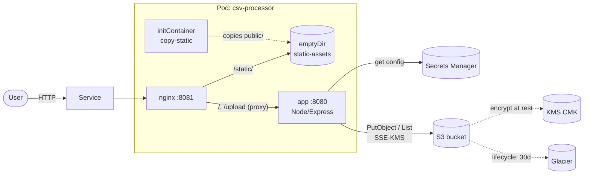
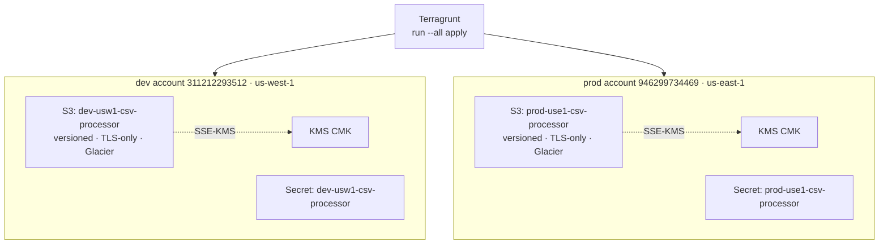
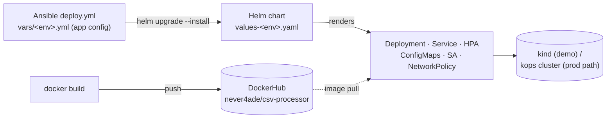
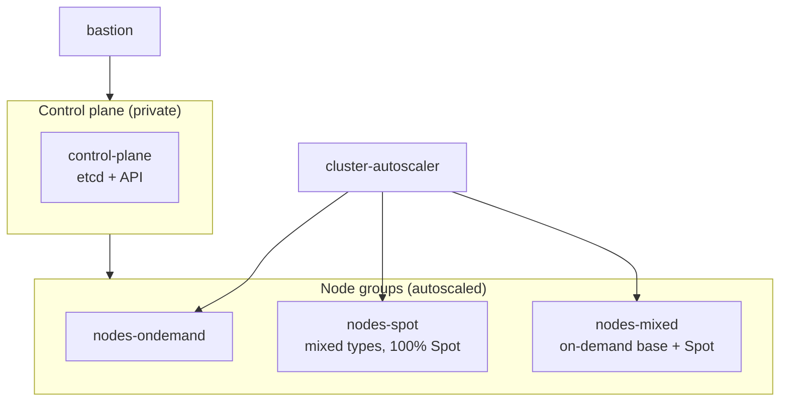

# Architecture

DevOps case study — a hardened CSV-processor web app on Kubernetes, with
multi-account AWS infrastructure (Terragrunt), Helm/Ansible delivery, and a
kops cluster definition.

## 1. Runtime request flow (the pod + AWS)

Nginx and the app run in **one pod**, sharing static assets through an in-pod
**emptyDir** (not NFS). Nginx serves `/static/` from that volume and proxies
everything else to the app, which talks to AWS.

## 2. Multi-account / multi-region infrastructure (Terragrunt)

Each environment is a **separate AWS account**. Terragrunt provisions the same
units per account, named `<env>-<region_short>-csv-processor`.

State is **per region** (`<env>-<region_short>-s3-tf-state`) for DR isolation.

## 3. Delivery: build → push → Ansible → Helm → cluster

The image is built once and pushed to DockerHub. **Ansible** owns the per-env
application config and invokes **Helm**, which renders the Kubernetes objects.

## 4. kops cluster topology (per environment)

Self-managed Kubernetes on EC2 (not EKS). Control plane runs on instances we
own; workloads spread across on-demand, Spot, and mixed node groups, all behind
the cluster autoscaler.

> dev = 1 control-plane (us-west-1, 2 AZs); prod = 3 control-plane HA (us-east-1, 3 AZs).

## Security highlights

| Layer | Controls |
| --- | --- |
| App | CSV formula-injection sanitization, output escaping (anti-XSS), upload limits, helmet/CSP |
| Image/pod | non-root (uid 1000), read-only rootfs, dropped capabilities, seccomp, NetworkPolicy |
| AWS | SSE-KMS, block-public-access, versioning, TLS-only bucket policy, Secrets Manager (no static keys), IRSA |
| Cluster (kops) | IMDSv2, private topology, audit logging, kubelet CIS hardening, etcd/secrets encryption, Cilium WireGuard |

## Component map

| Path | What |
| --- | --- |
| `app/` | Node.js/Express CSV processor (Docker image) |
| `helm/csv-processor/` | Helm chart + `values-dev/prod` |
| `ansible/` | per-env app config + deploy playbook |
| `kops/dev`, `kops/prod` | kops cluster definitions |
| `IAC-terragrunt/` | S3 + KMS + Secrets Manager per account/region |
