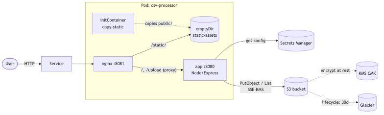
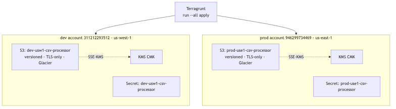
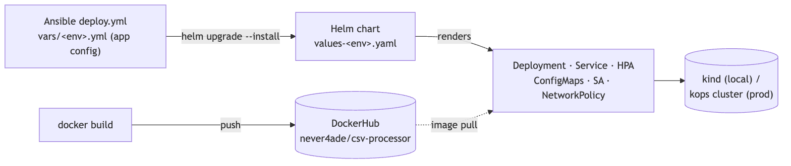
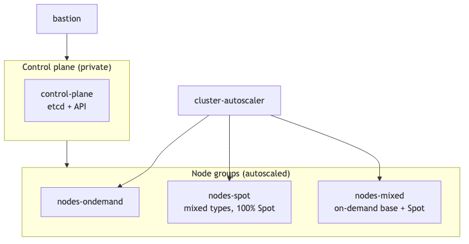

# DevOps Case Study — Solution

**Author:** Aditya  ·  **Repository:** <https://github.com/adi4fab/microservice-end-to-end>  ·  **Container image:** <https://hub.docker.com/r/never4ade/csv-processor>

A hardened **CSV‑processor** web application delivered end‑to‑end: a Kubernetes
cluster definition (kops), the in‑cluster infrastructure (Helm + Ansible), the
application itself (Node.js), and the supporting AWS resources (Terragrunt) —
all built for **two environments (dev + prod)** across two separate AWS accounts.

> Built for a security‑focused review: every layer is hardened (least privilege,
> no static keys, encryption in transit and at rest, non‑root read‑only
> containers, private networking).

---

## Quick links

| What | Where |
| --- | --- |
| Source code (public) | <https://github.com/adi4fab/microservice-end-to-end> |
| Container image (public) | `never4ade/csv-processor:1.0.0` — <https://hub.docker.com/r/never4ade/csv-processor> |
| Case‑study deliverable | [`devops-case-study/`](https://github.com/adi4fab/microservice-end-to-end/tree/main/devops-case-study) |
| App | [`devops-case-study/app/`](https://github.com/adi4fab/microservice-end-to-end/tree/main/devops-case-study/app) |
| kops cluster config | [`devops-case-study/kops/`](https://github.com/adi4fab/microservice-end-to-end/tree/main/devops-case-study/kops) |
| Helm chart | [`devops-case-study/helm/csv-processor/`](https://github.com/adi4fab/microservice-end-to-end/tree/main/devops-case-study/helm/csv-processor) |
| Ansible | [`devops-case-study/ansible/`](https://github.com/adi4fab/microservice-end-to-end/tree/main/devops-case-study/ansible) |
| AWS infra (Terragrunt) | [`IAC-terragrunt/`](https://github.com/adi4fab/microservice-end-to-end/tree/main/IAC-terragrunt) |

---

## Repository structure

```
microservice-end-to-end/
├── devops-case-study/
│   ├── app/                  Node.js CSV‑processor web app (Docker image)
│   ├── kops/                 kops cluster config — dev/ and prod/
│   ├── helm/csv-processor/   Helm chart (+ values-dev / values-prod)
│   ├── ansible/              per‑env app config + deploy playbook
│   └── docs/                 architecture diagrams + this document
├── IAC-terragrunt/           S3 + KMS + Secrets Manager (dev & prod accounts)
└── kind-config.yaml          local 3‑node kind cluster (for the live demo)
```

---

## Architecture

### Diagram 1 — Runtime request flow (the pod + AWS)

Nginx and the app run in **one pod**, sharing static assets through an in‑pod
`emptyDir` (not NFS). Nginx serves `/static/` from that volume and proxies
everything else to the app, which talks to AWS.



### Diagram 2 — Multi‑account / multi‑region infrastructure (Terragrunt)

Each environment is a **separate AWS account**. Terragrunt provisions the same
units per account; state is kept per region for DR isolation.



### Diagram 3 — Delivery pipeline (build → push → Ansible → Helm → cluster)

The image is built once and pushed to DockerHub. **Ansible** owns the per‑env
application config and invokes **Helm**, which renders the Kubernetes objects.



### Diagram 4 — kops cluster topology (per environment)

Self‑managed Kubernetes on EC2 (not EKS): control plane on instances we own;
workloads spread across on‑demand, Spot, and mixed node groups, all behind the
cluster autoscaler.



---

## Part 1 — Kubernetes cluster (kops)

Configuration artifacts only — the brief does not require a running cluster, so
both clusters are **written and validated** (kops 1.35.1, Kubernetes `v1.35.5`),
not applied. One folder per environment under `kops/`.

| | dev | prod |
| --- | --- | --- |
| Cluster name | `microsvc-dev.k8s.internal` | `microsvc-prod.k8s.internal` |
| Region | us‑west‑1 (2 AZs) | us‑east‑1 (3 AZs) |
| Control plane | 1 (cost‑saving) | 3 (HA etcd quorum) |
| State store | `s3://microsvc-dev-kops-state` | `s3://microsvc-prod-kops-state` |

**Instance groups (per env):** `control-plane` + three node groups —
`nodes-ondemand`, `nodes-spot`, `nodes-mixed`.

| Requirement | How it is met |
| --- | --- |
| Multiple instance groups | control‑plane + 3 node groups |
| Mixed instance group | `mixedInstancesPolicy` (multiple instance types) on `nodes-spot` and `nodes-mixed` |
| Lifecycle: spot **and** on‑demand | `nodes-ondemand` (on‑demand), `nodes-spot` (100 % Spot), `nodes-mixed` (on‑demand base + Spot) |
| Cluster autoscaler for all node groups | `clusterAutoscaler.enabled` + per‑node‑group discovery tags + `minSize != maxSize` |

**Security hardening:** IMDSv2 enforced on every IG (blocks pod‑SSRF →
node‑credential theft), private topology + bastion, API/SSH restricted to
internal CIDR (never `0.0.0.0/0`), API audit logging (never records secret
contents), CIS‑aligned kubelet, secrets/etcd/EBS encryption, **Cilium WireGuard**
node‑to‑node encryption, **IRSA** (OIDC, no static keys), node‑termination‑handler
for Spot drains, metrics‑server for the HPA. DNS uses the ICANN‑reserved
**`.internal`** private TLD via a Route53 **private hosted zone**.

---

## Part 2 — Infra (Helm + Ansible)

### Deployment — Nginx + app in one pod, sharing static files

A single Deployment runs **two containers in the same pod**:

- an **initContainer** copies the app's `public/` assets into a shared **`emptyDir`**;
- the **app** container (Node.js) serves the application;
- the **nginx** container serves `/static/` from the shared `emptyDir` and
  reverse‑proxies everything else to the app over pod loopback.

The shared `emptyDir` satisfies the *"share public files through shared storage
(not nfs)"* requirement.

| Requirement | How it is met |
| --- | --- |
| Nginx + app in same pod, shared storage (not nfs) | 2 containers + `emptyDir` populated by an initContainer |
| Expose with a Service | `Service` (ClusterIP in dev, LoadBalancer in prod) |
| Auto scaling for the deployment | `HorizontalPodAutoscaler` (CPU target 70 %) |
| Config management with Ansible | `ansible/vars/<env>.yml` holds the app config |
| Helm to render objects, reuse per env | one chart + `values-dev.yaml` / `values-prod.yaml` |

**Hardened pods:** non‑root (uid 1000), read‑only root filesystem, all Linux
capabilities dropped, `seccomp: RuntimeDefault`, and a default‑deny
**NetworkPolicy** (only nginx ingress; egress limited to DNS + HTTPS for AWS).

### Ansible owns the application config

`ansible/vars/dev.yml` and `vars/prod.yml` hold the per‑env `app_config`
(`SECRET_ID`, `AWS_REGION`, `PORT`), namespace, and image tag. `deploy.yml`
runs `helm upgrade --install`, injecting that config into the chart:

```console
ansible-playbook deploy.yml -e env=dev      # or: -e env=prod
```

### Helm enables environment reuse

The same chart renders every Kubernetes object; a new environment is just a new
`values-<env>.yaml` overlay (replica counts, Service type, HPA bounds, IRSA role
ARN). This is the *"reuse while creating new environments"* requirement.

---

## Part 3 — Development (the web application)

A **Node.js / Express** app (image `never4ade/csv-processor:1.0.0`).

| Requirement | How it is met |
| --- | --- |
| Parse & process CSV like `soh.csv` | streaming CSV parser; rows printed to the browser |
| Print line content to browser | parsed rows rendered server‑side (EJS, auto‑escaped) |
| Upload UI + show previously processed files | upload form + list of objects under the S3 `processed/` prefix |
| Upload processed CSV to S3 | `PutObject` with **SSE‑KMS** server‑side encryption |
| S3 Glacier transition | lifecycle rule transitions `processed/` to **GLACIER** at 30 days |

**Security in the app:** CSV **formula‑injection** sanitization (neutralises
`=`, `+`, `-`, `@` cell prefixes), output escaping (anti‑XSS), strict CSP via
helmet, upload size/type limits, and **no static credentials** — configuration
comes from **AWS Secrets Manager** and credentials from the default AWS provider
chain (IRSA in‑cluster).

---

## Supporting AWS infrastructure (Terragrunt)

Provisioned with Terragrunt across **two separate AWS accounts**, one unit each
for S3, KMS, and Secrets Manager per environment.

| | dev | prod |
| --- | --- | --- |
| Account / region | `311212293512` / us‑west‑1 | `946299734469` / us‑east‑1 |
| S3 bucket | `dev-usw1-csv-processor` | `prod-use1-csv-processor` |
| Secret | `dev-usw1-csv-processor` | `prod-use1-csv-processor` |

Each S3 bucket is **versioned**, **block‑public‑access**, **TLS‑only** (bucket
policy), **SSE‑KMS** encrypted with a customer‑managed key, and carries the
**Glacier lifecycle** transition on `processed/`. Terraform state is kept in
per‑region buckets for DR isolation, with native S3 locking.

---

## Security highlights (all layers)

| Layer | Controls |
| --- | --- |
| Application | CSV formula‑injection sanitization, output escaping (anti‑XSS), upload limits, helmet/CSP, config via Secrets Manager (no keys in code) |
| Image / pod | non‑root (uid 1000), read‑only rootfs, dropped capabilities, seccomp, NetworkPolicy |
| AWS | SSE‑KMS, block‑public‑access, versioning, TLS‑only bucket policy, IRSA (no static keys), per‑account isolation |
| Cluster (kops) | IMDSv2, private topology + bastion, audit logging, CIS kubelet, etcd/secrets/EBS encryption, Cilium WireGuard, private DNS |

---

## How to run

**Application (local):**

```console
docker run --rm -p 8080:8080 \
  -e S3_BUCKET=<bucket> -e AWS_REGION=<region> \
  never4ade/csv-processor:1.0.0
# open http://localhost:8080
```

**Deploy to a cluster (Ansible → Helm):**

```console
cd devops-case-study/ansible
ansible-playbook deploy.yml -e env=dev      # or env=prod
```

**kops (validate the config without applying):**

```console
cd devops-case-study/kops
export NAME=microsvc-dev.k8s.internal
kops create -f dev/cluster.yaml -f dev/ig-*.yaml
kops update cluster $NAME                    # dry run (no --yes)
```

**AWS infra (Terragrunt):**

```console
cd IAC-terragrunt/live/dev && terragrunt run --all apply   # then prod/
```

---

## Requirement coverage

| Brief | Status |
| --- | --- |
| kops: multiple IGs, mixed IG, spot + on‑demand lifecycle | ✅ |
| kops: cluster autoscaler for all node groups | ✅ |
| Deployment: Nginx + app same pod, shared storage (not nfs) | ✅ |
| Service object | ✅ |
| Auto scaling for the deployment | ✅ |
| Config management with Ansible | ✅ |
| Helm to render objects, reuse across environments | ✅ |
| Web app: parse/process CSV, print lines to browser | ✅ |
| Upload UI + show previously processed files | ✅ |
| Upload processed CSV to S3 | ✅ |
| S3 Glacier transition | ✅ |
| Documentation + architecture diagram | ✅ (this document) |

## Notes & deliberate choices

- **Local cluster:** used **kind** (a real multi‑node cluster: 1 control‑plane +
  2 workers) instead of Minikube, to exercise true pod scheduling. The app was
  deployed and tested live on it against real AWS.
- **Images:** stored on **DockerHub** (public), as suggested — no ECR needed for
  this workflow.
- **Two environments:** every component (kops, Helm values, Ansible vars,
  Terragrunt) is provided for **both dev and prod**, across two AWS accounts.
- **kops clusters are config‑only** (validated, not applied) as the brief states.
